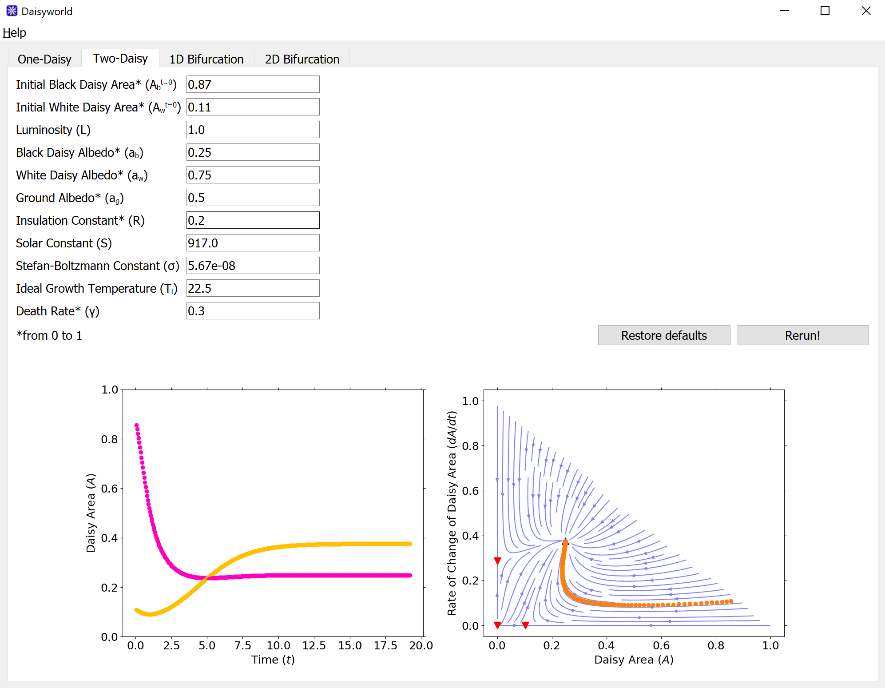

# 🌼 Daisyworld Resources

## What is Daisyworld?
The Daisyworld model was originally devised by Andrew Watson and James Lovelock, and attempts to demonstrate the significance of biosphere in the regulation of planet’s environmental variables. Among other effects, Daisyworld illustrates how the biosphere can affect the albedo of the planet to regulate her temperature. The model can be used to explore how the behaviours of dynamical systems can be studied, by introducing concepts such as initial conditions, evolution of the states and fixed points. Further understanding of dynamical systems can be facilitated by the visualization of more advanced concepts such as stability of the fixed points, bifurcation, and hysteresis.

## Quick Start
Download the code:
```
git clone https://github.com/nus-sps/earth-daisyworld-article.git
```
Then install the required Python packages, run
```
pip install -r requirements.txt
```
and then run `daisyworldGUI.py`.

### Files
- `daisyworldGUI.py` is a stand-alone GUI application based on PyQT5. Useful for codeless lessons.
- `daisyworld1.py` and `daisyworld2.py` are python scripts that visualize the dynamics of Daisyworld. Require `utils1d.py` and `utils2d.py`.
- `utils1d.py` and `utils2d.py` contain utility functions for plotting and finding steady state position/stability so that students can instead focus on the Daisyworld model itself.
- `icon.ico` is a pretty 16-by-16 icon for the Daisyworld GUI application.

## Screenshot


## Further Reading
- [NASA: This World is Black and White](https://svs.gsfc.nasa.gov/10898)
- [Daisyworld original paper](https://www.tandfonline.com/doi/abs/10.3402/tellusb.v35i4.14616)

## License
The project is licensed under the terms of GPL-3.0-or-later. More information about the license [here](https://www.gnu.org/licenses/).\
Author: Kun Hee Park
